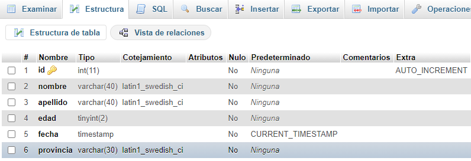
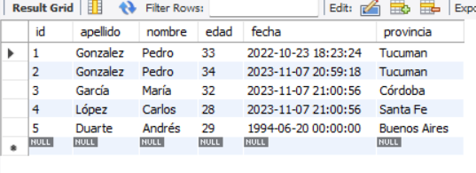

# ACTIVIDAD OBLIGATORIA BASE DE DATOS!

## Tarea Obligatoria Unidad n°11

1) Crea una base de datos con la siguiente estructura

  

2) Ingresa 5 registros
3) Hacer un back up de la base de datos creada

## Características del proyecto
En este proyecto se realiza practica de la creacion y la insercion de datos con el lenguaje SQL.}

La version final del proyecto es:

La sentencia que se utilizo para crear la tabla es la siguiente:

